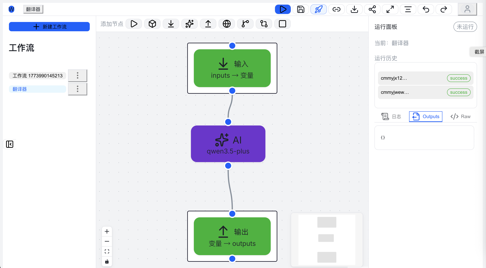
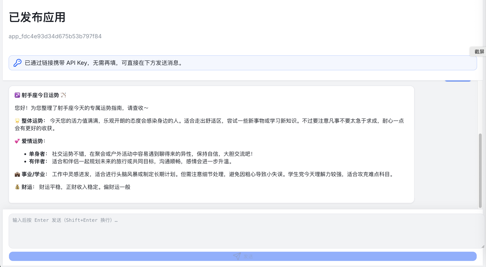

# AI 工作流编排平台（类 Dify 低代码）


基于 **React Flow + NestJS** 的 AI 工作流编排平台：在画布上连接节点，即可编排「输入 → AI / HTTP / 条件分支 → 输出」，支持**发布为对外 App**（API + Web 嵌入）。

---

## 主要功能

| 能力 | 说明 |
|------|------|
| **可视化编排** | 拖拽画布、多类型节点与连线；图结构持久化为 Workflow，支持保存与再次编辑。 |
| **丰富节点类型** | 开始 / 触发 / 透传 / 结束、**输入映射**、**输出映射**、**AI（多提供商）**、**HTTP 请求**、`condition_if` / `condition_switch` 分支。 |
| **DAG 同步执行引擎** | 按拓扑顺序执行；上游输出通过 `{{节点字段}}` 注入下游；完整 **RunRecord + 每节点 nodeLogs** 落库。 |
| **异步执行（可选）** | 对内运行可走 **Bull + Redis** 队列，HTTP 快速返回 `runId`，轮询结果。 |
| **发布与应用** | 一键发布生成 **WorkflowVersion 快照** + **App**（对外 `appId`）；编辑草稿不影响已发布版本，可再次发布切版本。 |
| **对外 API** | `POST /api/apps/:appId/run` + `Authorization: Bearer <ApiKey>`，按快照执行并返回结构化输出；支持限流与 Key 哈希存储。 |
| **Web 嵌入对话** | 发布页/嵌入链接可在浏览器中与已发布工作流对话；助手回复支持 **Markdown / GFM** 渲染。 |
| **AI 提供商** | **OpenAI** 与 **阿里云百炼（DashScope）** 可配置；LLM 调用带重试与退避。 |

更多发布与数据模型见 [`docs/PUBLISH_DESIGN.md`](docs/PUBLISH_DESIGN.md)，架构说明见 [`docs/DESIGN.md`](docs/DESIGN.md)。

---

## 项目亮点

- **「编辑态」与「线上态」分离**：发布即固定快照，避免线上随草稿误改动；版本可追溯。
- **同一套执行引擎**：控制台运行、队列任务、对外 `apps/:appId/run` 均走 **ExecutionService**，行为一致。
- **低代码友好**：AI 节点配置 System Prompt、模型与输入映射；HTTP/条件节点覆盖常见编排场景，无需写脚手架代码。
- **可观测**：每次运行保留节点级 input / output / error，便于排查与产品化日志展示。
- **Monorepo**：`apps/api` + `apps/web` + `packages/shared-types`，类型与约定集中维护。

---

## 项目结构

```
ai-workflow-platform/
├── apps/
│   ├── api/          # NestJS 后端（工作流 CRUD + 发布 + 执行引擎 + App/API Key）
│   └── web/          # React + TypeScript + React Flow 前端
├── packages/
│   └── shared-types/ # 共享类型（Workflow / Node / Edge / Run）
├── docs/
│   ├── DESIGN.md      # 架构与阶段说明
│   └── PUBLISH_DESIGN.md  # 发布、App、ApiKey 设计
└── README.md
```

## 核心数据结构（摘要）

- **Workflow**：id, name, version, status, graph(nodes, edges), variables
- **WorkflowVersion**：workflowId, version, snapshot（发布时的只读快照）
- **App**：对外 appId、绑定的 workflowVersionId
- **WorkflowNode**：id, type(start|trigger|plain|end|input|output|ai|http|condition_*), position, data
- **RunRecord**：workflowId, workflowVersion, status, inputs, outputs, nodeLogs

详见 `docs/DESIGN.md` 与 `packages/shared-types/src/`。

## 本地运行

### 1. 环境

- Node.js 18+
- **pnpm**（仓库为 workspace，推荐在根目录安装依赖）
- PostgreSQL（推荐 Docker）
- Redis（异步运行队列时需要；仅同步调试和对外同步 run 时可按需）
- 使用 AI 节点时配置 `DASHSCOPE_API_KEY` 和/或 `OPENAI_API_KEY`（见 `apps/api/.env.example`）

### 2. 依赖与数据库

在项目根目录：

```bash
pnpm install
docker compose up -d postgres redis   # 可选但推荐
cd apps/api
cp .env.example .env   # 配置 DATABASE_URL、REDIS_URL、AI Key 等
npx prisma migrate dev
```

### 3. 后端

```bash
# 根目录
pnpm run dev:api
# 或 apps/api 内: pnpm run start:dev
```

API 默认：<http://localhost:3001>

### 4. 前端

```bash
pnpm run dev:web
# 或 apps/web 内: pnpm run dev
```

前端默认：<http://localhost:3000>，开发时请求经 Vite 代理 `/api` → 3001。

### 5. Docker（PostgreSQL + Redis）

```bash
docker compose up -d postgres redis
```

- **PostgreSQL**：`localhost:5436`（与 `apps/api/.env.example` 中 `DATABASE_URL` 一致）
- **Redis**：`localhost:6379`

停止：`docker compose down`（加 `-v` 会删除数据卷）。

## 已实现能力概览

- 工作流列表、新建、打开、保存；**发布**生成版本与 App；**对外运行与嵌入**
- 可视化编辑器与节点配置：**AI / HTTP / 条件 / 输入输出** 等
- **同步执行**全图；**Bull 异步**（`POST /runs` 入队）可选
- RunRecord **nodeLogs** 落库；发布 API 鉴权与限流

## 后续演进（见 DESIGN.md）

- 更丰富的调试面板、流式输出、更多节点类型与治理（配额、审计等）
